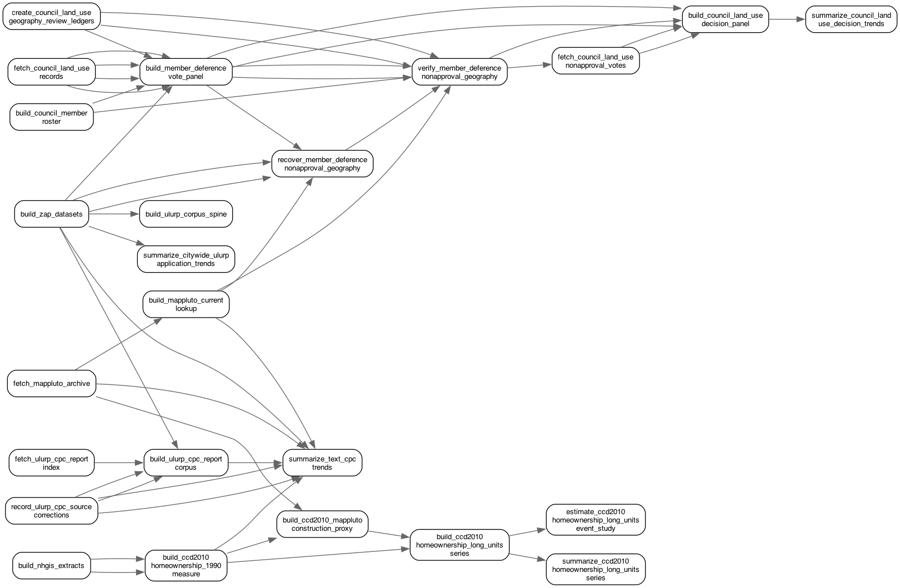

# NYC Court Case

This repository builds the data and draft paper for a project on New York City housing production, homeownership exposure, and Council land-use decision making.

The workflow is task-based. Each main task lives in `tasks/<task_name>/` with `code/`, `input/`, and `output/` folders. Run a task from its `code/` folder with `make`. Run the paper from `paper/` with `make`.

## Task Graph

The graph below is generated from the concrete dependencies declared in the
main task Makefiles. Run `make task-graph` from the repository root to update it.



## Running the Project

After downloading the repo, install the system tools used by the pipeline:

- GNU Make
- R
- Python 3 with `pip`
- LaTeX with `pdflatex` and `bibtex`

The root Makefile runs `tasks/setup_environment` before building the paper. That
task checks command-line tools, installs missing R and Python packages, and
prints the exact Homebrew or apt command to run if a compiled R package such as
`sf` needs geospatial system libraries.

For a full rebuild when the NHGIS files are not already saved in `data_raw/`,
set an IPUMS API key first:

```sh
export IPUMS_API_KEY="your-ipums-key"
make
```

Equivalently, from R you can run
`ipumsr::set_ipums_api_key("<your key>", save = TRUE)` and then restart R
before running `make`.

The pipeline downloads public source files as needed into task outputs or
`data_raw/`. The small archived DCP 2010 City Council boundary ZIP used for the
paper's 2010 district geography is committed at
`data_raw/dcp_boundary_city_council_districts_archive/10C/nycc_10cav.zip`. If
the NHGIS raw extract files are already present, the IPUMS key is not used.

## Data Collection and Extraction

- `setup_environment`: installs and records the R and Python package environment.
- `source_registry`: copies the source catalog for paper and member-deference inputs.
- `fetch_mappluto_archive`: downloads the pinned DCP MapPLUTO 25v4 archive ZIP used by the paper construction proxy.
- `build_nhgis_extracts`: standardizes NHGIS tract inputs for the 1990 homeownership measure.
- `build_zap_datasets`: standardizes ZAP project and project-BBL files.
- `fetch_council_land_use_records`: fetches and parses NYC Council Legistar land-use matter, action, history, and member-vote records.

## Cleaning and Intermediate Data

- `build_ccd2010_homeownership_1990_measure`: builds 1990 homeownership exposure for 2010 Council districts.
- `build_mappluto_current_lookup`: builds the current parcel lookup used for BBL and address joins.
- `build_ccd2010_mappluto_construction_proxy`: builds MapPLUTO-based construction proxies.
- `build_ccd2010_homeownership_long_units_series`: builds annual housing production series.
- `build_council_member_roster`: builds the Council member roster used to identify local members.
- `create_council_land_use_geography_review_ledgers`: stores reviewed geography corrections for Council land-use matters with unclear affected districts.
- `build_member_deference_vote_panel`, `recover_member_deference_nonapproval_geography`, `verify_member_deference_nonapproval_geography`, `fetch_council_land_use_nonapproval_votes`, and `build_council_land_use_decision_panel`: build the Council land-use decision and local-member vote series.

## Paper and Summary Outputs

- `build_ccd2010_homeownership_1990_measure`: creates the 2010 Council district homeownership map used in the paper.
- `summarize_ccd2010_homeownership_long_units_series`: creates raw-unit descriptive housing production plots.
- `estimate_ccd2010_homeownership_long_units_event_study`: creates raw-unit event-study and long-difference outputs.
- `summarize_council_land_use_decision_trends`: creates the member-deference land-use decision trend plot.
- `summarize_citywide_ulurp_application_trends`: creates annual citywide ULURP application counts.
- `summarize_text_cpc_trends`: creates initial rule-based CPC text-signal trends citywide and by Figure 2 homeowner tercile.
- `task_graph`: creates the main task graph and task list.

The paper can also be rebuilt from the paper folder:

```sh
cd paper
make
```
